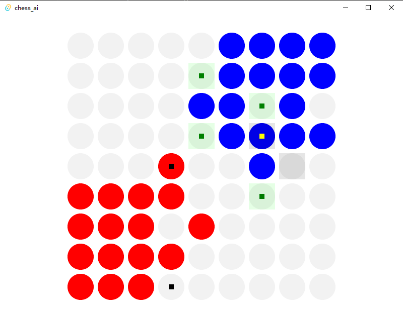

<div style="text-align: center">

# SOME GAME AI
某种跳棋的AI




</div>

## 规则介绍
### 胜利条件
红蓝各占据棋盘一角，红色在左下角4x4区域，蓝色在右上角4x4区域。  
如果红色将所有自己16个棋子转移到右上角4x4区域，则红色胜利；  
如果蓝色将所有自己16个棋子转移到左下角4x4区域，则蓝色胜利。

### 招法规则
每次可以将任意棋子移动到上下左右的空格中，或者可以间隔一个任意颜色的棋子跳跃。  
跳跃可以任意多次。

## 算法介绍
内部有两种实现，MCTS和alpha-beta search。
### MCTS
由于该游戏为non-periodic，无法通过随机模拟达到结束状态，因此在随机模拟过程中，认为棋子无法更进一步即为胜利。
### AB Search
该方法的要点是估值函数。
以红色为例，估值函数为到右上方(2.5, 2,5)处的曼哈顿距离。此外，在右上方4*4区域内不认为距离有区别，因此原理(2.5, 2.5)点的格子有相应的bonus。
## 构建
需要安装Rust工具链，以及Node环境
```
yarn tauri build
```
